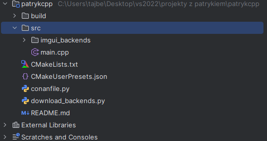

# GETTING STARTED AND SO ON
- used this two:
  - https://docs.conan.io/2/tutorial/consuming_packages/the_flexibility_of_conanfile_py.html
  - https://thescienceofcode.com/imgui-quickstart/

- start in (for me):
  - C:\Users\tajbe\Desktop\vs2022\projekty z patrykiem\patrykowy
- file structure (for me):



## 1. install cmake and conan
### 1.1. install cmake
```
choco install cmake
```
> [!TIP]
> in conanfile.py change cmake version i guess? idk

### 1.2. install conan
```
choco install conan
```
> [!IMPORTANT]
> or you can use pip
```
pip install conan
```

## 2. install dependencies
### 2.1. download imgui backends (my python script)
```
python3 download_backends.py
```
### 2.2. install rest of dependencies by conan
```
conan install . --output-folder=build --build=missing
```
```
cd build
```
```
.\conanbuild.bat
```

## 3. build
```
cmake .. -G "Visual Studio 17 2022" -DCMAKE_TOOLCHAIN_FILE="conan_toolchain.cmake"
```
```
cmake --build . --config Release
```

## 4. run
```
.\Release\patrykcpp.exe
```

## 5. deactivate conan
```
.\deactivate_conanbuild.bat
```
> [!WARNING]
> idk what this does; to find out later


# GITHUB
## 1. just for me (for later), how to initialize git -> github etc
```
git init
```
```
git status
```
```
git add .
```
```
git commit -m "jakis commit"
```
> [!NOTE]
> now make EMPTY repo on github, and copy the link to it
```
git remote add origin http://link_to_repo
```
```
git push -u origin master
```

## 2. get new changes from github
```
git pull
```

## 3. push changes to github
```
git status
```
```
git add .
```
```
git commit -m "jakis commit"
```
```
git push
```
